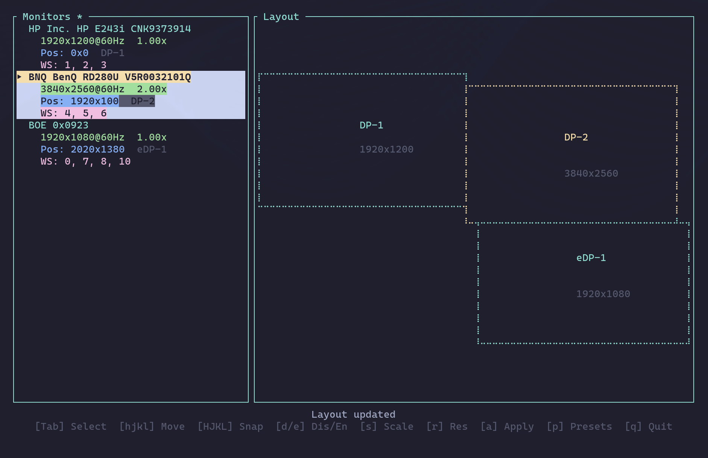
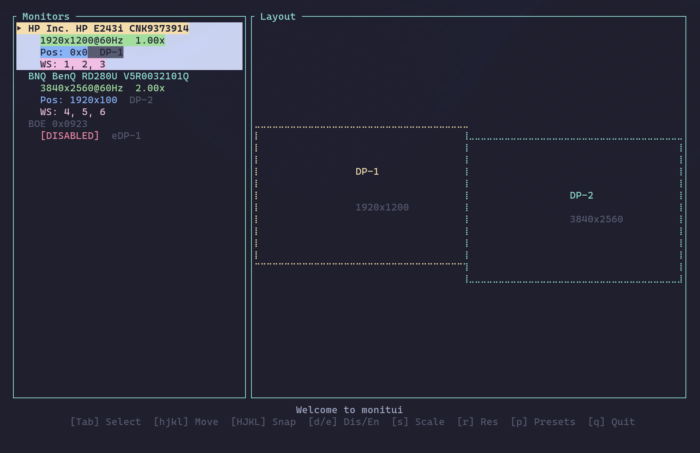
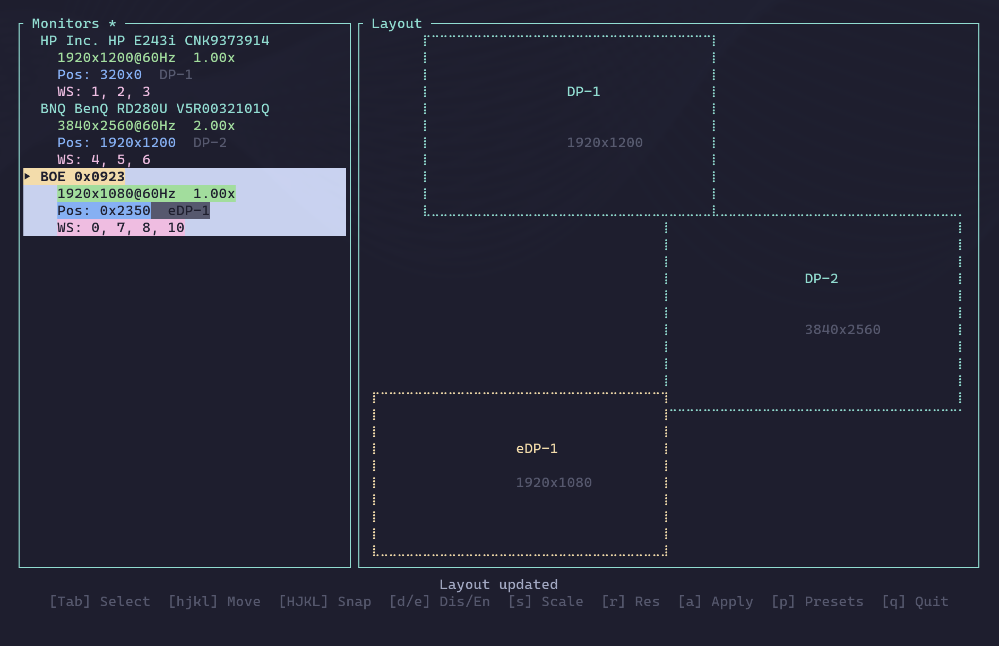

# monitui

*a lovely tui for wrangling your hyprland monitors like nobodies business. built with rust ofc ofc*


## What's This?

Growing up on MacOS everything just worked. Switching to Arch/hyprland I feel as though I can do anything, but `working` is not the default setting, messing with complicated monitor setups being top of the list. 

`monitui` is a terminal UI that makes Hyprland monitor configuration actually *pleasant*. Move monitors around with `hjkl`, drag them with your mouse (yes terminal + mouse is a good thing), save presets, and generally feel like a wizard.

## Nifty features

- **Visual canvas** - See your monitors laid out spatially (not just a config file!)
- **Keyboard shortcuts** - `hjkl` to move, `Shift+HJKL` to really move edges, arrow keys work too
- **Mouse support** - This is awesome, a little finnicky around the edges (fine tune with keyboard)
- **Presets** - Save your desk/couch/coffee-shop setups and switch instantly
- **Live preview** - See changes before you apply them
- **Safety net** - 10-second confirmation window (your monitor config should be more forgiving than `rm hdmi.monitor`)
- **Workspace assignment** - I want my workspaces in order, nice and tidy. The presets menu can also restore where you last left them



## Installation

```bash
cargo install --path .
```

Or, if you wanna do things yourself:

```bash
cargo build --release
sudo cp target/release/monitui /usr/local/bin/
```

## Usage

Just run it:

```bash
monitui
```

### Keybindings

| Key | Action |
|-----|--------|
| `hjkl` / arrows | Move selected monitor |
| `Shift+HJKL` / `Shift+arrows` | Snap to far edge |
| `Tab` / `Shift+Tab` | Select monitor |
| `1-9` | Assign workspace |
| `W` | Clear workspace assignments |
| `d` / `e` | Disable / enable monitor |
| `r` | Cycle resolution |
| `s` | Cycle scale |
| `+` / `-` | Adjust scale |
| `p` | Presets menu (press `1-9` to load, `s` to save) |
| `a` | Apply configuration |
| `q` / `Esc` | Quit |

You can also click on monitors with your mouse like it's the future.


*Your desk setup, but make it TUI*

## Presets

Hit `p` to open the preset menu. Your configs live in `~/.config/monitui/presets/`.

Press number keys `1-9` to instantly load a preset. No more trying to find the correct file for home vs. work


*The dream: all your monitors exactly where you want them. This is unironically kinda fun*

## Why Does This Exist?

Arch is great, everything should be in the terminal, but I should not have to deal with monitor positions as numbers and not graphics. 

`monitui` gives you a visual representation of your monitors and lets you move them around like a normal human being. You can even use your mouse! Revolutionary, we know.

This probably already exists. I had fun building this the way I wanted it. Feel free to mark this project as duplicate in the issues, I'd love to see other implementions. 

## Requirements

- Hyprland (obviously)
- A terminal emulator
- At least one monitor (technically optional but highly recommended)

## Contributing

Feel free to contribute. If you're going to AI a PR, at least have a model >= Codex 5.3 or Opus 4.6 take care of it, anything less and I don't want it. 

## License

MIT

---

*Built with [ratatui](https://github.com/ratatui-org/ratatui), love, and an unhealthy number of external displays.*

## Disclaimers

This was vibe coded with Claude Opus 4.6. I tried to save some of the prompts in `doc/prompt`, but I missed most of them. Maybe I'll find a way to export them and share it with this.
It works great on my machine (an Omarchy Hyprland setup), but no guarentees about yours. It passes all of the AI written tests, is written in Rust, and I've inspected enough of the code to feel confident publishing this. 
